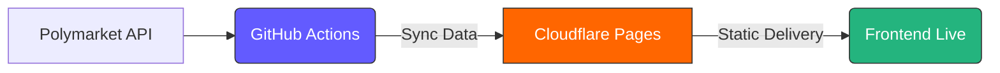

# PolyLens

PolyLens is a professional-grade market discovery dashboard for [Polymarket](https://polymarket.com). It filters thousands of active markets in real-time to surface high-probability opportunities with deep liquidity and imminent resolution.

**🌐 Live App:** [polylens.aivault.securityjunky.com](https://polylens.aivault.securityjunky.com/)

---

## ✨ Key Features

- **Probability Range Filter** — Set a min and max probability to find markets that match your exact confidence level.
- **Liquidity Presets** — Quick-select 5K / 10K / 25K / 50K minimum volume, or enter a fully custom threshold.
- **Expiry Window** — Filter markets by days remaining to resolution.
- **Flexible Sort** — Sort ascending or descending by Probability, Liquidity, or Expiry.
- **Category Chips** — One-click filter by market category (Politics, Crypto, Finance, Geopolitics, Tech, etc.).
- **Yes / No Filter** — Further narrow results to Yes or No outcome positions.
- **Theme Support** — Fully refined Light and Dark modes, saved across sessions.
- **Persistent Config** — All filter settings are automatically saved to localStorage and restored on next visit.

---

## 🔧 Filters Reference

| Filter | Control | Default | Notes |
|---|---|---|---|
| Liquidity ≥ | Dropdown + Custom input | 10K | Presets: 5K, 10K, 25K, 50K, or custom number |
| Expiry ≤ | Number input | 1 day | Maximum days until market resolution |
| Probability | Min – Max range | 80% – 100% | Both bounds inclusive |
| Sort | Dropdown | Prob ↓ | Prob ↑↓ · Liquidity ↑↓ · Expiry ↑↓ |

---

## 🏗 System Architecture

The system is fully automated, using GitHub Actions for data syncing and Cloudflare Pages for global delivery.



---

## 📂 Project Structure

```
src/
├── css/
│   ├── main.css      # Dashboard design system
│   └── popup.css     # Browser extension popup styles
├── data/
│   └── cache.json    # Auto-synced market data (do not edit manually)
├── js/
│   ├── main.js       # Dashboard controller (filters, render, config)
│   └── popup.js      # Browser extension popup controller
├── icons/            # App icons
└── index.html        # Main dashboard
scripts/              # Data sync and validation scripts
```

---

## 🛠 Local Development

The easiest way to run locally is with Docker:

```bash
docker-compose up
```

The dashboard will be available at **http://localhost:8080**.

---

## 🚢 Deployment

Built for **Cloudflare Pages** with zero-config deployment.

1. **Connect GitHub:** Link this repository to Cloudflare Pages.
2. **Build Settings:**
   - Build Command: *(leave blank)*
   - Output Directory: `src`
3. **Automate:** GitHub Actions (`.github/workflows/sync-data.yml`) handle all market data updates automatically every 10 minutes.

---

## ✅ Implementation Notes

- **Config Persistence:** All filter settings (liquidity preset, custom value, expiry, probability range, sort direction) are auto-saved to `localStorage` on every change and restored on page load.
- **Onboarding:** Smart welcome overlay reappears every 7 days.
- **Privacy First:** No server-side tracking. All preferences are local to your browser.
