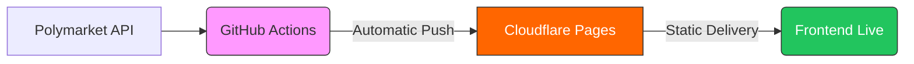

# PolyLens UI

A professional market discovery tool. Data is updated every 10 minutes and delivered globally via Cloudflare.

**🌐 Live App:** [polylens.aivault.securityjunky.com](https://polylens.aivault.securityjunky.com/)

## 🏗 How it Works
The system is 100% automated. GitHub handles the data processing, and Cloudflare serves the static result.



## 🚀 Key Features
- **Instant Filters:** Real-time ROI, Probability, and Liquidity discovery.
- **Hands-off:** Data refreshes automatically every 10 minutes.
- **Privacy:** Your filter configurations never leave your browser.
- **Responsive:** Optimized for Desktop, Tablet, and Mobile.

## 🛠 Local Development
Run the app locally with Docker:
```bash
docker-compose up
```
Available at `http://localhost:8080`.

## 🚢 Deployment
Built for **Cloudflare Pages** with zero-config deployment.

1. **Connect GitHub:** Link this repo to Cloudflare Pages.
2. **Setup:** Set build output to `src` (leave build command blank).
3. **Go Live:** GitHub Actions handle all updates automatically.

## ✅ Summary
- **Fast:** Global CDN delivery with zero server overhead.
- **Secure:** 100% static frontend with no backend vulnerabilities.
- **Scalable:** Built to serve 10k+ concurrent users.
