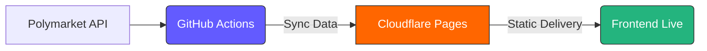

# PolyLens Elite

PolyLens is a professional-grade market discovery and alpha-scoring dashboard for Polymarket. It filters thousands of active markets to find high-probability opportunities with mispriced ROI and deep liquidity.

**🌐 Live App:** [polylens.aivault.securityjunky.com](https://polylens.aivault.securityjunky.com/)

## ✨ Key Features
- **Elite Dashboard:** Modern, high-performance UI inspired by Stripe/Dropbox.
- **Alpha Discovery:** Proprietary scoring for implied ROI and imminent expiry.
- **Liquidity Intelligence:** Real-time volume filtering for minimal slippage.
- **Theme Support:** Fully refined Light and Dark modes.
- **Privacy First:** Filter configurations are stored locally in your browser.

## 🏗 System Architecture
The system is 100% automated, utilizing GitHub Actions for data processing and Cloudflare for global static delivery.



## 📂 Project Structure
Following full-stack web standards:
- `src/js/`: Modular JavaScript controllers (`main.js`, `popup.js`).
- `src/css/`: Modern design system styles (`main.css`, `popup.css`).
- `src/data/`: Auto-synced market intelligence JSON.
- `scripts/`: Data synchronization and validation logic.

## 🛠 Local Development
The easiest way to run the app locally is with Docker:
```bash
docker-compose up
```
The dashboard will be available at `http://localhost:8080`.

## 🚢 Deployment
Built for **Cloudflare Pages** with zero-config deployment.

1. **Connect GitHub:** Link this repository to Cloudflare Pages.
2. **Build Settings:** 
   - Build Command: (Leave blank)
   - Output Directory: `src`
3. **Automate:** GitHub Actions (`.github/workflows/sync-data.yml`) handle all market updates automatically every 10 minutes.

## ✅ Implementation Details
- **Capital Efficiency:** Sort by imminent expiry to maximize internal rate of return.
- **Onboarding:** Smart welcome overlay reappears every 7 days to keep users informed of the latest scoring changes.
- **Standardized:** Fully compliant with modern web development practices and clean file structures.
