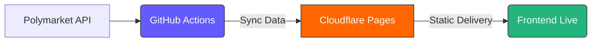

# PolyLens

PolyLens is a market discovery dashboard for [Polymarket](https://polymarket.com). It scans the active market cache and makes it easier to spot high-probability opportunities with real liquidity and near-term resolution. Maintained as part of Shantanu Ghumade's project network.

**🌐 Live App:** [polylens.aivault.securityjunky.com](https://polylens.aivault.securityjunky.com/)

---

## ✨ Key Features

- **Probability range** — Set minimum and maximum probabilities so the list matches the confidence band you care about.
- **Liquidity presets** — Pick 5K / 10K / 25K / 50K minimum liquidity, or type in a custom threshold.
- **Expiry window** — Focus on markets by days remaining until resolution.
- **Flexible sort** — Sort either direction by probability, liquidity, or expiry.
- **Category chips** — Filter quickly by Politics, Crypto, Finance, Geopolitics, Tech, and other market categories.
- **Yes / No filter** — Narrow the table to one side of a market.
- **Theme support** — Light and dark modes are saved across visits.
- **Persistent config** — Filter settings are saved in `localStorage` and restored on the next page load.

---

## 🔧 Filters Reference

| Filter | Control | Default | Notes |
|---|---|---|---|
| Liquidity ≥ | Dropdown + Custom input | 10K | Presets: 5K, 10K, 25K, 50K, or custom number |
| Expiry ≤ | Number input | 1 day | Maximum days until market resolution |
| Probability | Min – Max range | 80% – 100% | Both bounds inclusive |
| Sort | Dropdown | Prob ↓ | Prob ↑↓ · Liquidity ↑↓ · Expiry ↑↓ |

---

## 🏗 System Architecture

PolyLens is a static app served by Cloudflare Pages. GitHub Actions refreshes the market data cache on a schedule and commits the generated files back to the repo.


```mermaid
graph LR
    A[Polymarket API] --> B(GitHub Actions)
    B -->|Sync Data| C[Cloudflare Pages]
    C -->|Static Delivery| D(Frontend Live)

    style B fill:#635bff,stroke:#333,color:#fff
    style C fill:#f60,stroke:#333,color:#fff
    style D fill:#24b47e,stroke:#333,color:#fff
```

---

## 📂 Project Structure

```
src/
├── css/
│   ├── main.css      # Dashboard design system
│   └── popup.css     # Browser extension popup styles
├── data/
│   ├── index.json    # Manifest for the sharded market cache
│   ├── cache_*.json  # Auto-synced market shards (do not edit manually)
│   └── market_map.json
├── js/
│   ├── cacheLoader.js # Shared sharded-cache loader
│   ├── main.js       # Dashboard controller (filters, render, config)
│   └── popup.js      # Browser extension popup controller
├── icons/            # App icons
└── index.html        # Main dashboard
scripts/              # Data sync and validation scripts
```

---

## 🛠 Local Development

The easiest way to run locally is with Docker:

```bash
docker-compose up
```

The dashboard will be available at **http://localhost:8080**.

---

## 🚢 Deployment

Built for **Cloudflare Pages**. The app is static, so deployment is intentionally small: serve the `src` directory and let the workflow keep data fresh.

1. **Connect GitHub:** Link this repository to Cloudflare Pages.
2. **Build Settings:**
   - Build Command: *(leave blank)*
   - Output Directory: `src`
3. **Automate:** GitHub Actions (`.github/workflows/sync-data.yml`) refreshes market data every 4 hours, and it can also be run manually.

---

## ✅ Implementation Notes

- **Config persistence:** Filter settings (liquidity preset, custom value, expiry, probability range, and sort direction) are saved to `localStorage` as they change.
- **Onboarding:** The welcome overlay reappears every 7 days.
- **Privacy:** There is no server-side tracking; preferences stay in the browser.
